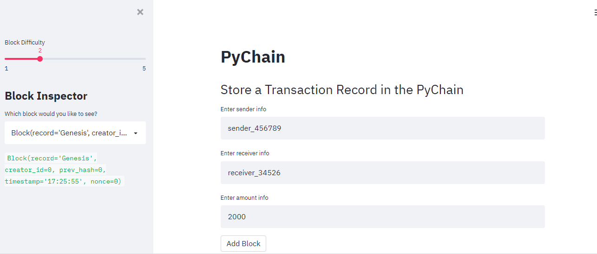
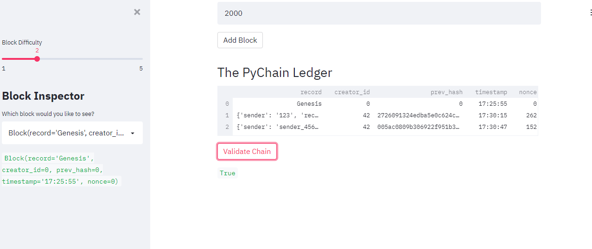
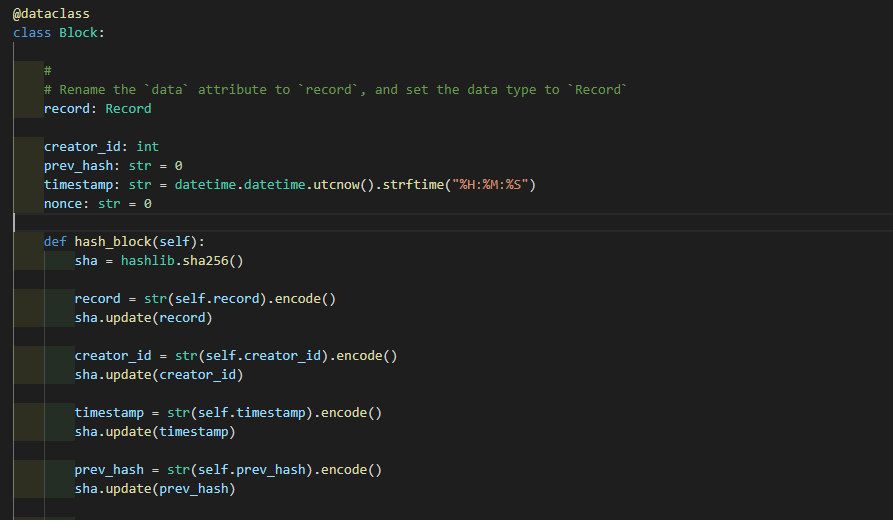
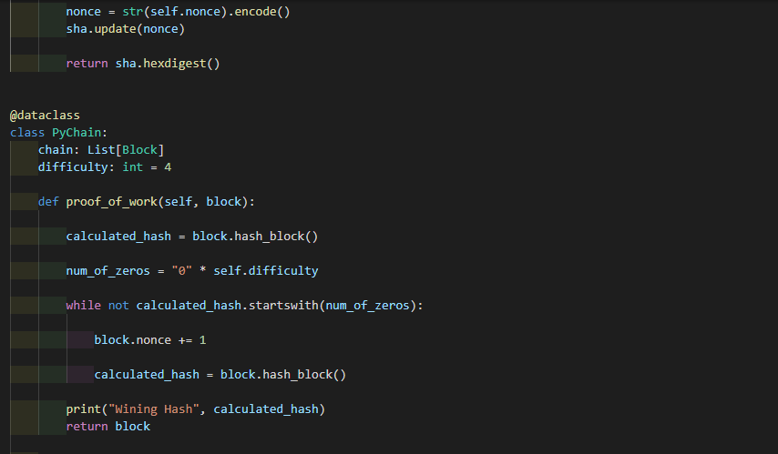
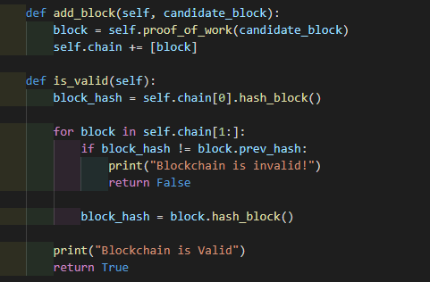
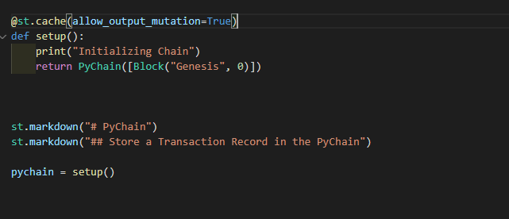
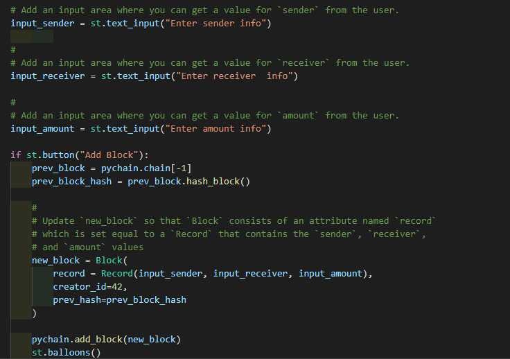
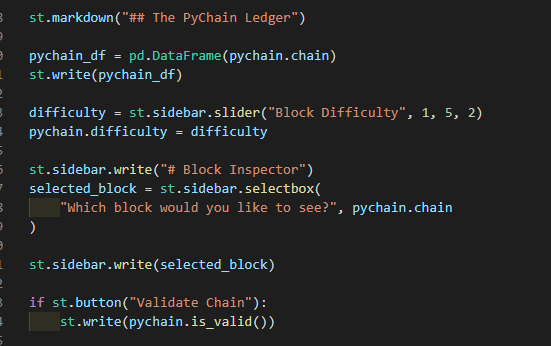
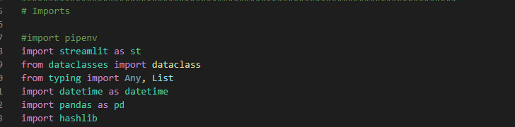

# Blockchain Application

This is an application build upon blockchain-based ledger system in a decentralized system and with a user-friendly web interface. This ledger would allow banks to conduct financial transactions ie.transfer money between senders and receivers and to verify the integrity of the data in the ledger.

----------------------------------------------------------------------------------------------------------------------------------------------------------------------------

#Web-interface

----------------------------------------------------------------------------------------------------------------------------------------------------------------------------

#Web-interface

----------------------------------------------------------------------------------------------------------------------------------------------------------------------------

Creation of Record Data Class 

----------------------------------------------------------------------------------------------------------------------------------------------------------------------------

----------------------------------------------------------------------------------------------------------------------------------------------------------------------------

Adding Relevant User Inputs to the Web Interface

----------------------------------------------------------------------------------------------------------------------------------------------------------------------------

Testing the PyChain Ledger by Storing Records

----------------------------------------------------------------------------------------------------------------------------------------------------------------------------

Adding Relevant User Inputs to the Web Interface

----------------------------------------------------------------------------------------------------------------------------------------------------------------------------

Adding Relevant User Inputs to the Web Interface

----------------------------------------------------------------------------------------------------------------------------------------------------------------------------

.
